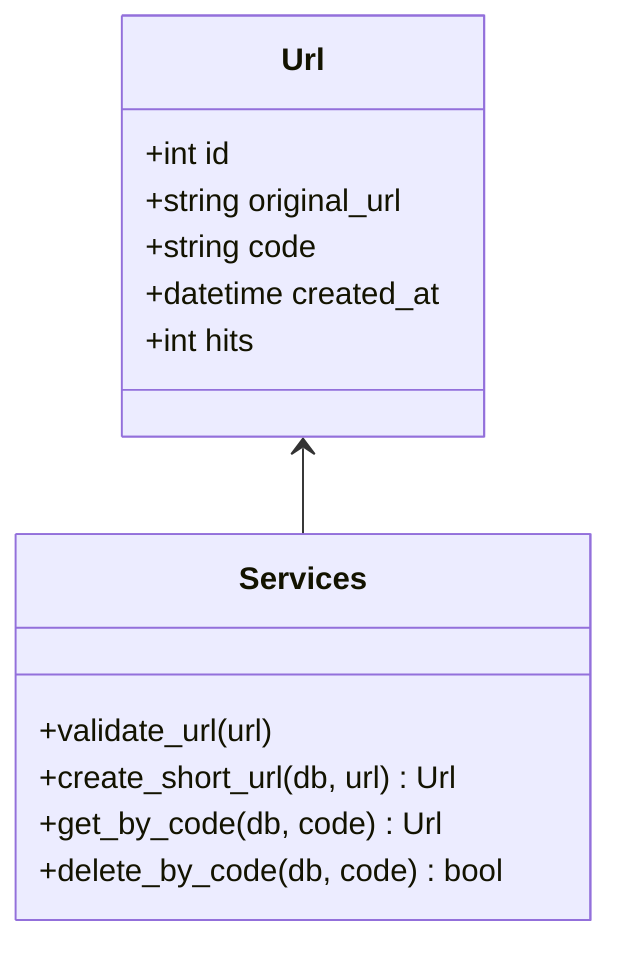

# tinyurlr — Report

## Abstract
(150–200 words: what the app does, tech choices, results: tests pass, features implemented.)

## 1. SDLC Model & Documentation
- Chosen model: **Lean/Iterative** suitable for small scope + fast feedback.
- Planning & Requirements (attach/checkpoint doc). 
- Traceability: requirement → endpoint/file → test evidence.

## 2. Architecture Overview
Include the diagram and describe modules.

```mermaid
flowchart LR
  U[User/Browser] -->|POST /shorten| API[FastAPI]
  U -->|GET /{code}| API
  API --> S[(SQLite DB)]
  API -->|render| T[Templates (Jinja2)]
  subgraph Services
    SRV[services.py\nvalidate & code gen]
  end
  API --> SRV
```



## 3. Implementation of Features
- Feature 1: POST /shorten (validation + persistence)
- Feature 2: GET /{code} (redirect + hit count)
- Feature 3: GET /urls and DELETE /urls/{code}

Show code snippets + screenshots.

## 4. Code Quality & Git
- Small modules, comments, tests.
- Commit log with meaningful messages.

## 5. DevOps Reflection
- Next steps: Dockerfile, GitHub Actions CI, DB switch to Postgres, rate limiting, link expiry, logging/metrics.

## 6. AI Usage Statement
I used GitHub Copilot for autocompletion and ChatGPT to draft boilerplate and refine documentation phrasing. All core design, debugging, and final code were authored and verified by me.
